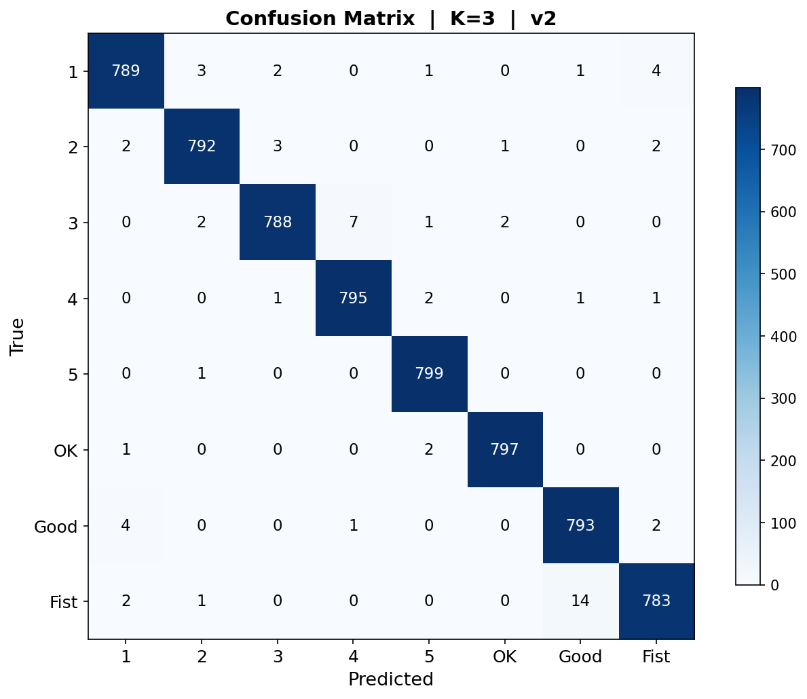

# Hand Gesture Recognition Control System

Real-time hand gesture recognition based on **MediaPipe + KNN**, designed for embedded deployment on Raspberry Pi.



## Features

- **8 Gesture Classes**: 1, 2, 3, 4, 5, OK, Good (👍), Fist (✊)
- **Real-time Pipeline**: Camera → MediaPipe Hand Landmarks → Feature Extraction → KNN Classification → GPIO Control
- **English UI**: OpenCV overlay with gesture name, FPS, and confidence
- **GPIO Control**: LED, Fan, Buzzer triggered by recognized gestures
- **Anti-jitter**: 5-frame majority vote smoothing + thumb-angle guard for 4↔5 disambiguation
- **Cross-platform**: Raspberry Pi (RPi.GPIO) or PC (mock GPIO)

## Quick Start

```bash
# 1. Install dependencies
pip install -r requirements.txt

# 2. Run the system
python src/main.py

# Press 'q' to quit.
```

## Project Structure

```
├── src/                    # Source code
│   ├── main.py             # Real-time pipeline entry
│   ├── capture/            # Camera capture (OpenCV)
│   ├── detection/          # MediaPipe HandLandmarker wrapper
│   ├── features/           # Feature extraction (distance + angle + finger states)
│   ├── classifier/         # KNN classifier (scikit-learn)
│   └── control/            # GPIO peripheral control
├── scripts/                # Utility scripts
│   ├── train_hagrid.py     # Train KNN from HaGRID landmarks
│   ├── convert_hagrid.py   # Convert HaGRID annotations → features
│   ├── export_pictures.py  # Export hand skeleton visualizations
│   └── deploy_pi.py        # Package for Raspberry Pi deployment
├── data/
│   └── models/
│       └── knn_model.pkl   # Trained KNN model (99.0% accuracy)
├── graph/                  # Training visualizations
├── config/                 # YAML configuration
└── assets/mediapipe/       # MediaPipe model files
```

## Performance

| Metric | Value |
|--------|-------|
| Accuracy | **99.0%** (HaGRID v2 test set) |
| Cross-validation | 99.07% (±0.18%) |
| K-value | K=3 (distance-weighted) |
| Features | 32-dimensional (distance + angle + finger states + thumb) |
| Training samples | 32,000 (8 classes × 4,000) |

## Raspberry Pi Deployment

```bash
# Package for Pi
python scripts/deploy_pi.py --output pi_deploy

# Copy to Pi
scp -r pi_deploy/* pi@raspberrypi:~/gesture-system/

# On Pi:
cd ~/gesture-system
pip install -r requirements-pi.txt
python src/main.py
```

### GPIO Wiring (BCM)
```
LED    → GPIO 17
Fan    → GPIO 18
Buzzer → GPIO 27
```

## Dataset

Trained on [HaGRID v2](https://github.com/hukenovs/hagrid) (HAnd Gesture Recognition Image Dataset) by SberDevices.

- 1,086,158 FullHD images, 33 gesture classes, 65,977 subjects
- Pre-computed MediaPipe 21-hand-landmarks used for feature extraction
- License: CC BY-SA 4.0

**Citation:**
> Nuzhdin et al., "HaGRIDv2: 1M Images for Static and Dynamic Hand Gesture Recognition", arXiv:2412.01508, 2024.
> Kapitanov et al., "HaGRID — HAnd Gesture Recognition Image Dataset", WACV 2024.

## Gesture → Action Mapping

| Gesture | Display | GPIO Action |
|---------|---------|-------------|
| Index up | 1 | LED ON |
| Two fingers | 2 | LED OFF |
| Three fingers | 3 | Fan ON |
| Four fingers | 4 | Fan OFF |
| Five fingers | 5 | Buzzer beep |
| OK sign | OK | Buzzer beep |
| Thumbs up | Good | Welcome mode (LED flash) |
| Fist | Fist | All OFF |

## License

Apache 2.0 (MediaPipe components) + Project code.
